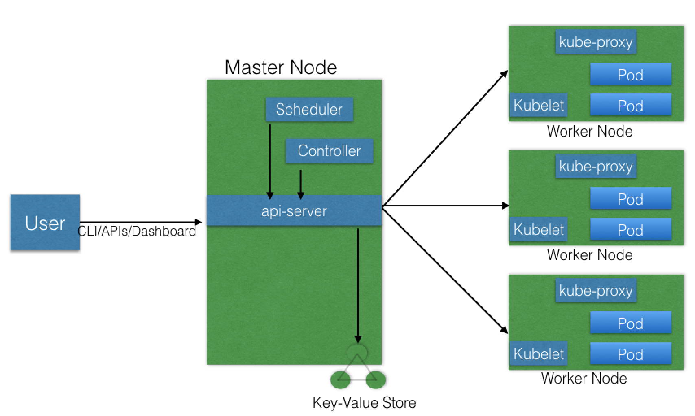
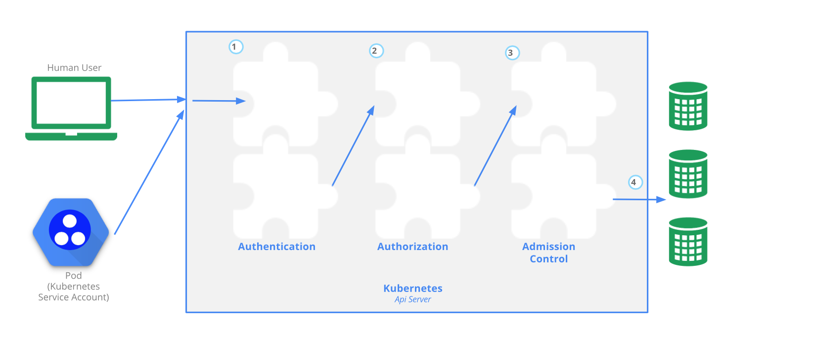

These are the notes I summarized/copied from [Introduction to Kubernetes](https://courses.edx.org/courses/course-v1:LinuxFoundationX+LFS158x+1T2018/course/).

The lab part covered in Chapter 5, 10, 12.
The theory part covered in all other Chapters.

Note kubernetes terms have short name and full name, ex: deploy==deployment

# Chapter 2

1. Define Kubernetes

an open-source system for automating deployment, scaling, and management of containerized applications. (k8s)


2. Discuss the features of Kubernetes.
- **automatic binpacking** automatically schedules the containers based on resource usage and contraints
- **self-healing** automatically replaces and reschedules the containers from failed nodes. It also kills and restart the containers which do not respond to heath checks.
- **Horizontal scaling** automatically scale applications based on resource usuage like CPU and memory.
- **Servic discovery and Load balancing** Kubernetes groups sets of containers and refers to them via a Domain Name System(DNS) - service. Kubernetes can discover these services automatically, load-balance requests between containers of a given service.
- **Automated rollouts and rollbacks** roll out and roll back new versions/configuration of an app
- **Secrets and configuration management** manage secrets and configuration details for an app without rebuilding the respective images.
- **Storage orchestration** automatically mout local, external, and storage solutions to the containers in a seamless manner, based on software-defined storage(SDS).
- **Batch execution** 

3. Why kubernetes

- portable and extensible
- can be deployed on the environment of our choice
- has a very modular and pluggable architecture.
- can write custom APIs or plugins to extend its functionality.


# Chapter 3

1. Kubernetes architechture./pics/Kubernetes_Architecture.png

- 1++ master node
- 1++ worker node
- Distributed key-value store, like etcd




2. master and worker nodes

- master node :
	- manage cluster,
	- entry point for all admin tasks.
	- We communicate to master node via CLI, GUI, API
	- may be more than one master node due to fault tolerance. Only one of them lead and perform all operations, rest would be followers
	- all master nodes connect to etcd
	- **A master node components**:
		- API server: All admin tasks are performed via API server. User sends REST commands to API server, which validates and processes the requests. The result state of cluster then is stored in etcd
		- Scheduler : schedules work to worker nodes
		- Controller manager: mamage different non-terminating control loops, which regulate the state of the Kubernetes cluster
		- etcd: distributed key-value store which is used to store the cluster state


- worke node: 
	- Runs app using pods and controlled by master node.  Pods have the necessary tools to run and connect them. A Pod is the scheduling unit of kubernetes. It is a logical connection of one or more containers are always scheduled together.
	- **A worker node components** :
		- Container runtime (3 kinds)
			- containered (Docker used containered)
			- rkt
			- Ixd
		- kubelet
			- runs on each worker node and communicates with the master node. It receiveds the Pod definition, and runs the containers associated with the Pod. It also makes sure that the  containers which are part of the Pods are healty all the time.
			- connects to the container via CRI(container runtime interface). CRI implements 2 service - ImageService(image-related operations) and RuntimeService(pod and container-related operations)
		
		- kube-proxy
			- network proxy that runs on worker node and listens to API server for each Service endpoint creation/deletion. We use service to access the application

3. cluster state management with etcd

Kubernetes uses etcd to store the cluster state. etcd is distributed key-value store based on Raft Consensus Algo. Raft allows a collection of machines to work as a group that can survive the failures of some of members. At any time, one of the nodes will be master and rest are followers. Any node could be master.

4. Kubernetes network setup requirments
- A unique IP is assigned to each Pod  <= Kubernetes uses CNI(Container Network Interface) to assign IP to Pod.
- Containers in a Pod can communicate to each other <= Containers inside a Pod shared the same network namespace, so they reach each other by localhost
- The Pods is able to communicate to other Pods in cluster <= all nodes should be able to reach any Pod. Achieved via Google Kubernetes Engine, Sofware Defined Network(Flannel, Weave, Calico etc)
- If configured, the app deployed in a Pod is accessible from external world. <= kube-proxy


# Chapter 4

1. Kubernetes configuration options

- All-in-One Single-Node Installation
- Single-Node etcd, Single-Master, and Multi-Worker Installation
- Single-Node etcd, Multi-Master, and Multi-Worker Installation
- Multi-Node etcd, Multi-Master, and Multi-Worker Installation


2. Infrastructure
- localhost (minikube etc)
- On-premise installation
- cloud

3. Kubernetes installation tools and resources
- kubeadm
- KubeSpray
- Kops

# Chapter 5(Lab)
```
Install VirtualBox on macOS

Install Minikube 
We can download the latest release from the Minikube release page. Once downloaded, we need to make it executable and copy it in the PATH.

$ curl -Lo minikube https://storage.googleapis.com/minikube/releases/v0.25.0/minikube-darwin-amd64 && chmod +x minikube && sudo mv minikube /usr/local/bin/

Start Minikube
We can start Minikube with the minikube start command:

minikube start
Starting local Kubernetes v1.9.0 cluster... 
Starting VM... 
Downloading Minikube ISO 
 142.22 MB / 142.22 MB [============================================] 100.00% 0s 
Getting VM IP address... 
Moving files into cluster... 
Downloading localkube binary 
 162.41 MB / 162.41 MB [============================================] 100.00% 0s 
 0 B / 65 B [----------------------------------------------------------] 0.00% 
 65 B / 65 B [======================================================] 100.00% 0s
Setting up certs... 
Connecting to cluster... 
Setting up kubeconfig... 
Starting cluster components... 
Kubectl is now configured to use the cluster.
Loading cached images from config file.

Check the status
We can see the status of Minikube with the minikube status command:

$ minikube status
minikube: Running
cluster: Running
kubectl: Correctly Configured: pointing to minikube-vm at 192.168.99.102

Stop Minikube
We can stop Minikube with the minikube stop command:

$ minikube stop
Stopping local Kubernetes cluster...
Machine stopped.

```


# Chapter  6

1. Methods to access any Kubernetes 
- CLI (kubectl)
- GUI (Kubernetes dashboard)
- APIs
	- HTTP API space has 3 components
		- Core Group (api/v1)
		- Name Group (/apis/$Name/$Version)
		- System-wide (/healthz, /logs, /metrics etc)


2. Configure kubectl

```
Download the latest stable kubectl binary

$ curl -LO https://storage.googleapis.com/kubernetes-release/release/$(curl -s https://storage.googleapis.com/kubernetes-release/release/stable.txt)/bin/darwin/amd64/kubectl

Make the kubectl binary executable

$ chmod +x ./kubectl

Move the kubectl binary to the PATH

$ sudo mv ./kubectl /usr/local/bin/kubectl

```

3. Access Minibuke dashboard

`minikube dashboard`
or ` kubectl proxy`

4. Access Minibuke via APIs.

- With kubectl proxy
```
When kubectl proxy is configured, we can send requests to localhost on the proxy port:

$ curl http://localhost:8001/
{
 "paths": [
   "/api",
   "/api/v1",
   "/apis",
   "/apis/apps",
   ......
   ......
   "/logs",
   "/metrics",
   "/swaggerapi/",
   "/ui/",
   "/version"
 ]
}%

With the above curl request, we requested all the API endpoints from the API server.
```

- Without kubectl proxy

```
Without kubectl proxy configured, we can get the Bearer Token using kubectl, and then send it with the API request. A Bearer Token is an access token which is generated by the authentication server (the API server on the master node) and given back to the client. Using that token, the client can connect back to the Kubernetes API server without providing further authentication details, and then, access resources. 

Get the token

TOKEN=$(kubectl describe secret -n kube-system $(kubectl get secrets -n kube-system | grep default | cut -f1 -d ' ') | grep -E '^token' | cut -f2 -d':' | tr -d '\t' | tr -d " ")

Get the API server endpoint

$ APISERVER=$(kubectl config view | grep https | cut -f 2- -d ":" | tr -d " ")

Make sure the APISERVER is pointing to your Minikube's IP (for example, in our case, it is pointing to Minikube's IP 192.168.99.100:8443)

$ echo $APISERVER
https://192.168.99.100:8443

Access the API Server using the curl command, as shown below

$ curl $APISERVER --header "Authorization: Bearer $TOKEN" --insecure
{
 "paths": [
   "/api",
   "/api/v1",
   "/apis",
   "/apis/apps",
   ......
   ......
   "/logs",
   "/metrics",
   "/swaggerapi/",
   "/ui/",
   "/version"
 ]
}%

```


# Chapter 7


1. Kubernetes object model

Kubernetes has a very rich object model, with which it represents different persistent entities in the Kubernetes cluster. Those entities describe:
- What containerized app we are running and on which node
- App resource consumption
- Different policies attched to app, like restart/upgrade policies, fault tolerance etc

Kubernetes objects
	- examples are Pods, ReplicaSets, Deployments, Namespace, etc.
	- With each object, we declare our intent or desired state using **spec** field. Kubernetes system manages **status** field of objects. The API request to create the object must have the **spec** field etc in JSON format. Most often in .yaml file which later is converted by kubectl in a JSON payload and sent to API server.
	- An example of Deployment object: 
		With the apiVersion field in the example above, we mention the API endpoint on the API server which we want to connect to. With the kind field, we mention the object type - in our case, we have Deployment. With the metadata field, we attach the basic information to objects, like the name. You may have noticed that in our example we have two spec fields (spec and spec.template.spec). With spec, we define the desired state of the deployment. In our example, we want to make sure that, at any point in time, at least 3 Pods are running, which are created using the Pods Template defined in spec.template. In spec.template.spec, we define the desired state of the Pod. Here, our Pod would be created using nginx:1.7.9.

	```
	apiVersion: apps/v1

	kind: Deployment

	metadata:

	  name: nginx-deployment

	  labels:

	    app: nginx

	spec:

	  replicas: 3

	  selector:

	    matchLabels:

	      app: nginx

	  template:

	    metadata:

	      labels:

	        app: nginx

	    spec:

	      containers:

	      - name: nginx

	        image: nginx:1.7.9

	        ports:

	        - containerPort: 80


     ```


2. Kubernetes building blocks

- Pods
	- smallest Kubernetes object == unit of deployment in Kubernetes == a single instance of app
	- a logical collection of 1 or more containers which
		- are scheduled together on the same host
		- share same namespace
		- mount the same external storage(volume)
	- pods cant' self-heal. We use controllers(Deployment, ReplicaSets, ReplicationControllers etc) to handle replication, fault-tolerance etc
	- We attch the Pods' specification to other objects using Pods Template.

	

- ReplicationControllers(rc): 
	- part of master node's controller manager to make sure the specified number of replicas for a Pod, ie create and manage Pods; 
	- ONLY supports equality-based selectors.

- ReplicaSet(rs): 
	- next generation of rc, 
	- support both equality- and set-based selectors.
	- rs can create one more Pod if the current state doesn't match desired state.
	- mostly used by Deployments to orchestrate Pod creation, deletion and updates. A Deployment automatically creates rs

- Deployment
	- provide declarative updates to Pods and ReplicaSets.
	- DeploymentController is part of master node's controller manager to ensure current state == desired state
	- Deployment rollout is triggered when we update the Pods Template for a deployment. Operations like scaling deploymnet do not trigger rollout

- Namespaces
	- If we have many people to organize into team/projects, we can partition Kubernetes cluster into sub-clusters using Namespaces. The names of resources/objects created inside a Namespace are unique but not across Namespaces
	- List namespaces
		```
		$ kubectl get namespaces
		NAME          STATUS       AGE
		default       Active       11h
		kube-public   Active       11h
		kube-system   Active       11h
		```
	- Generally, Kubernetes creates two default Namespaces: kube-system and default. The kube-system Namespace contains the objects created by the Kubernetes system. The default Namespace contains the objects which belong to any other Namespace. By default, we connect to the default Namespace. kube-public is a special Namespace, which is readable by all users and used for special purposes, like bootstrapping a cluster. 
	- We use resources quotas to divide the cluster resources within a Namespaces

3. Labels and Selectors

- Labels : key-value pairs that are attached to objects, used to organize and select a subset of objects. Many objects can have the same labels.

- Label Selectors: use to select a subset of objects. Two types: Equality-based(with env==dev we are selecting the objects where the env Label is set to dev.)  vs  Set-based(with env in (dev,qa), we are selecting objects where the env Label is set to dev or qa.)

# Chapter 8

1. Authentication, authorization and access control stages of Kubernetes API access

3 stages to access API endpoint on the API server
- Authentication : Logs in a user.
- Authorization: Authorizes the API requests added by the logged-in user.
- Admission Control: Software modules that can modify or reject the requests based on some additional checks, like Quota.



2. Different users

- Normal Users
	They are managed outside of the Kubernetes cluster via independent services like User/Client Certificates, a file listing usernames/passwords, Google accounts, etc.
- Service Accounts
	With Service Account users, in-cluster processes communicate with the API server to perform different operations. Most of the Service Account users are created automatically via the API server, but they can also be created manually. The Service Account users are tied to a given Namespace and mount the respective credentials to communicate with the API server as Secrets.


3. Different modules for authentication and authorization

- Authentication modules
	- Client Certificates
		To enable client certificate authentication, we need to reference a file containing one or more certificate authorities by passing the --client-ca-file=SOMEFILE option to the API server. The certificate authorities mentioned in the file would validate the client certificates presented to the API server. A demonstration video covering this topic is also available at the end of this chapter.
	- Static Token File
		We can pass a file containing pre-defined bearer tokens with the --token-auth-file=SOMEFILE option to the API server. Currently, these tokens would last indefinitely, and they cannot be changed without restarting the API server.
	- Bootstrap Tokens
		This feature is currently in an alpha status, and is mostly used for bootstrapping a new Kubernetes cluster.
	- Static Password File
		It is similar to Static Token File. We can pass a file containing basic authentication details with the --basic-auth-file=SOMEFILE option. These credentials would last indefinitely, and passwords cannot be changed without restarting the API server.
	- Service Account Tokens
		This is an automatically enabled authenticator that uses signed bearer tokens to verify the requests. These tokens get attached to Pods using the ServiceAccount Admission Controller, which allows in-cluster processes to talk to the API server.
	- OpenID Connect Tokens
		OpenID Connect helps us connect with OAuth 2 providers, such as Azure Active Directory, Salesforce, Google, etc., to offload the authentication to external services.
	- Webhook Token Authentication
		With Webhook-based authentication, verification of bearer tokens can be offloaded to a remote service.
	- Keystone Password
		Keystone authentication can be enabled by passing the --experimental-keystone-url=<AuthURL> option to the API server, where AuthURL is the Keystone server endpoint.
	- Authenticating Proxy
		If we want to program additional authentication logic, we can use an authenticating proxy. 

- Authorization modules (After authentication, users can send API request to perform operations. These requests get authorized using modules)
	- Node Authorizer
		Node authorization is a special-purpose authorization mode which specifically authorizes API requests made by kubelets. It authorizes the kubelet's read operations for services, endpoints, nodes, etc., and writes operations for nodes, pods, events, etc. For more details, please review the Kubernetes documentation.
	- Attribute-Based Access Control (ABAC) Authorizer
		With the ABAC authorizer, Kubernetes grants access to API requests, which combine policies with  attributes. In the following example, user nkhare can only read Pods in the Namespace lfs158.

		```
			{
			  "apiVersion": "abac.authorization.kubernetes.io/v1beta1",
			  "kind": "Policy",
			  "spec": {
			    "user": "nkhare",
			    "namespace": "lfs158",
			    "resource": "pods",
			    "readonly": true
			  }
			}

		```

	To enable the ABAC authorizer, we would need to start the API server with the --authorization-mode=ABAC option. We would also need to specify the authorization policy, like --authorization-policy-file=PolicyFile.json. For more details, please review the Kubernetes documentation.

	- Webhook Authorizer
		With the Webhook authorizer, Kubernetes can offer authorization decisions to some third-party services, which would return true for successful authorization, and false for failure. In order to enable the Webhook authorizer, we need to start the API server with the --authorization-webhook-config-file=SOME_FILENAME option, where SOME_FILENAME is the configuration of the remote authorization service. For more details, please see the Kubernetes documentation.

	- Role-Based Access Control (RBAC) Authorizer
		In general, with RBAC we can regulate the access to resources based on the roles of individual users. In Kubernetes, we can have different roles that can be attached to subjects like users, service accounts, etc. While creating the roles, we restrict resource access by specific operations, such as create, get, update, patch, etc. These operations are referred to as verbs.

		In RBAC, we can create two kinds of roles:	

		Role
		With Role, we can grant access to resources within a specific Namespace.

		ClusterRole
		The ClusterRole can be used to grant the same permissions as Role does, but its scope is cluster-wide.

		In this course, we will focus on the first kind, Role. Below you will find an example:

		kind: Role
		apiVersion: rbac.authorization.k8s.io/v1
		metadata:
		  namespace: lfs158
		  name: pod-reader
		rules:
		- apiGroups: [""] # "" indicates the core API group
		  resources: ["pods"]
		  verbs: ["get", "watch", "list"]

		As you can see, it creates a pod-reader role, which has access only to the Pods of lfs158 Namespace. Once the role is created, we can bind users with RoleBinding.

		There are two kinds of RoleBindings:

		RoleBinding
		It allows us to bind users to the same namespace as a Role. We could also refer a ClusterRole in RoleBinding, which would grant permissions to Namespace resources defined in the ClusterRole within the RoleBinding’s Namespace.

		ClusterRoleBinding
		It allows us to grant access to resources at a cluster-level and to all Namespaces.

		In this course, we will focus on the first kind, RoleBinding. Below, you will find an example:

		kind: RoleBinding
		apiVersion: rbac.authorization.k8s.io/v1
		metadata:
		  name: pod-read-access
		  namespace: lfs158
		subjects:
		- kind: User
		  name: nkhare
		  apiGroup: rbac.authorization.k8s.io
		roleRef:
		  kind: Role
		  name: pod-reader
		  apiGroup: rbac.authorization.k8s.io

		As you can see, it gives access to nkhare to read the Pods of lfs158 Namespace.

		To enable the RBAC authorizer, we would need to start the API server with the --authorization-mode=RBAC option. With the RBAC authorizer, we dynamically configure policies.

- Admission Control

	To use admission controls, we must start the Kubernetes API server with the admission-control, which takes a comma-delimited, ordered list of controller names, like in the following example:

	```
		--admission-control=NamespaceLifecycle,ResourceQuota,PodSecurityPolicy,DefaultStorageClass.
	```
	By default, Kubernetes comes with some built-in admission controllers. 


# Chapter 9

1. Service

- Why Service?

	Pods are ephemeral so there is no static IP address. When old Pod dies, new Pod initiated will have a new IP which will not be known automatically to users. Therefore, we use Service to logically groups Pods and a policy to access them. The grouping is achieved by Label and Selector.

	


- An example of Servic object example:

	```
	kind: Service
	apiVersion: v1
	metadata:
	  name: frontend-svc
	spec:
	  selector:
	    app: frontend
	  ports:
	    - protocol: TCP
	      port: 80
	      targetPort: 5000
	```

	In this example, we are creating a frontend-svc Service by selecting all the Pods that have the Label app set to the frontend. By default, each Service also gets an IP address, which is routable only inside the cluster. In our case, we have 172.17.0.4 and 172.17.0.5 IP addresses for our frontend-svc and db-svc Services, respectively. The IP address attached to each Service is also known as the ClusterIP for that Service.

	The user/client now connects to a service via the IP address, which forwards the traffic to one of the Pods attached to it. A service does the load balancing while selecting the Pods for forwarding the data/traffic.

	While forwarding the traffic from the Service, we can select the target port on the Pod. In our example, for frontend-svc, we will receive requests from the user/client on Port 80. We will then forward these requests to one of the attached Pods on Port 5000. If the target port is not defined explicitly, then traffic will be forwarded to Pods on the port on which the Service receives traffic.

	A tuple of Pods, IP addresses, along with the targetPort is referred to as a Service endpoint. In our case, frontend-svc has 3 endpoints: 10.0.1.3:5000, 10.0.1.4:5000, and 10.0.1.5:5000.

- Services are the primary mode of communication in Kubernetes. Two methods of Service discovery
	- Environment Variables
		As soon as the Pod starts on any worker node, the kubelet daemon running on that node adds a set of environment variables in the Pod for all active Services. For example, if we have an active Service called redis-master, which exposes port 6379, and its ClusterIP is 172.17.0.6, then, on a newly created Pod, we can see the following environment variables:
			```
			REDIS_MASTER_SERVICE_HOST=172.17.0.6
			REDIS_MASTER_SERVICE_PORT=6379
			REDIS_MASTER_PORT=tcp://172.17.0.6:6379
			REDIS_MASTER_PORT_6379_TCP=tcp://172.17.0.6:6379
			REDIS_MASTER_PORT_6379_TCP_PROTO=tcp
			REDIS_MASTER_PORT_6379_TCP_PORT=6379
			REDIS_MASTER_PORT_6379_TCP_ADDR=172.17.0.6
			```
		With this solution, we need to be careful while ordering our Services, as the Pods will not have the environment variables set for Services which are created after the Pods are created.

	- DNS (common and recommended)
		Kubernetes has an add-on for DNS, which creates a DNS record for each Service and its format is like my-svc.my-namespace.svc.cluster.local. Services within the same Namespace can reach to other Services with just their name. For example, if we add a Service redis-master in the my-ns Namespace, then all the Pods in the same Namespace can reach to the redis Service just by using its name, redis-master. Pods from other Namespaces can reach the Service by adding the respective Namespace as a suffix, like redis-master.my-ns. 


- ServiceType
	- ClusterIP(default)
		A Service gets its Virtual IP address using the ClusterIP. That IP address is used for communicating with the Service and is accessible only within the cluster. 
	- NodePort
		a port from the range 30000-32767 is mapped to the respective Service, from all the worker nodes.
	- LoaderBalance
	- ExternalIP(not managed by Kubernetes)
	- ExternalName
		 make externally configured Services like my-database.example.com available inside the cluster, using just the name, like my-database, to other Services inside the same Namespace.

2. kube-proxy

All of the worker nodes run a daemon called kube-proxy, which watches the API server on the master node for the addition and removal of Services and endpoints. For each new Service, on each node, kube-proxy configures the iptables rules to capture the traffic for its ClusterIP and forwards it to one of the endpoints. When the service is removed, kube-proxy removes the iptables rules on all nodes as well.


# Chapter 10 (Lab)

1. Deploy an app using Minibuke GUI (In dashboard use create in top right corner)

```
minikube start
minikube status
minikube dashboard
```
By default, the dashboard is connected to the default Namespace. 

To investigate App
```
kubectl get deployments
kubectl get replicasets
kubectl get pods
kubectl describe pod $podname(ex:webserver-74d8bd488f-4chhn)
kubectl get pods -L k8s-app,label2  // -L add additional columns
kubectl get pods -l k8s-app=webserver // -l use selector
kubectl delete deployments webserver  //delete object
```

2. Deploy an app using CLI

```
kubectl create -f webserver.yaml //-f  pass in a file as object's specification
```

```
//webserver.yaml
apiVersion: apps/v1
kind: Deployment
metadata:
  name: webserver
  labels:
    app: nginx
spec:
  replicas: 3
  selector:
    matchLabels:
      app: nginx
  template:
    metadata:
      labels:
        app: nginx
    spec:
      containers:
      - name: nginx
        image: nginx:alpine
        ports:
        - containerPort: 80

```

3. Create a Service and Exposing it to external world with NodePort

```
kubectl get svc
kubectl describe svc web-service
minikube ip
minikube service web-service
```
```
//webserver-svc.yaml
apiVersion: v1
kind: Service
metadata:
  name: web-service
  labels:
    run: web-service
spec:
  type: NodePort
  ports:
  - port: 80
    protocol: TCP
  selector:
    app: nginx

```

4. Liveness and Readiness Probes

- Liveness
	- chekcs on an app's health, and if heath checks fails, it reaturs the affected container automatically
	- can be set by defining
		- Liveness command
			```
				apiVersion: v1
				kind: Pod
				metadata:
				  labels:
				    test: liveness
				  name: liveness-exec
				spec:
				  containers:
				  - name: liveness
				    image: k8s.gcr.io/busybox
				    args:
				    - /bin/sh
				    - -c
				    - touch /tmp/healthy; sleep 30; rm -rf /tmp/healthy; sleep 600
				    livenessProbe:
				      exec:
				        command:
				        - cat
				        - /tmp/healthy
				      initialDelaySeconds: 3
				      periodSeconds: 5    
	      	```
	      	The existence of the /tmp/healthy file is configured to be checked every 5 seconds using the periodSeconds parameter. The initialDelaySeconds parameter requests the kubelet to wait for 3 seconds before doing the first probe. When running the command line argument to the container, we will first create the /tmp/healthy file, and then we will remove it after 30 seconds. The deletion of the file would trigger a health failure, and our Pod would get restarted.
		- Liveness HTTP request (If return failure, restart affected container)
			```
			livenessProbe:
		      httpGet:
		        path: /healthz
		        port: 8080
		        httpHeaders:
		        - name: X-Custom-Header
		          value: Awesome
		      initialDelaySeconds: 3
		      periodSeconds: 3
			```
		- TCP Liveness Probe
			```
			livenessProbe:
		      tcpSocket:
		        port: 8080
		      initialDelaySeconds: 15
		      periodSeconds: 20
			```

- Readness Probe (configured similarly to Liveness Probes)

Sometimes, applications have to meet certain conditions before they can serve traffic. These conditions include ensuring that the depending service is ready, or acknowledging that a large dataset needs to be loaded, etc. In such cases, we use Readiness Probes and wait for a certain condition to occur. Only then, the application can serve traffic.

A Pod with containers that do not report ready status will not receive traffic from Kubernetes Services.

```
readinessProbe:
  exec:
    command:
    - cat
    - /tmp/healthy
  initialDelaySeconds: 5
  periodSeconds: 5
 ```


 # Chapter 11

 1. Why persistent data management

 All data stored in container is deleted if the container crashes. However, the kubelet will restart it with a clean state which means that it will not have any of old data.

 To overcome the problem, Kubernetes uses Volumes. A Volume is a directory backed by a storage medium. The storage medium and its content are determined by Volume Type.

 In Kubernetes, a Volume is attached to a Pod and shared among the containers of that Pod. The Volume has the same life span as the Pod, and it outlives the containers of the Pod - this allows data to be preserved across container restarts.


 2. Volume Type (determines size, content etc)
	- emptyDir
		An empty Volume is created for the Pod as soon as it is scheduled on the worker node. The Volume's life is tightly coupled with the Pod. If the Pod dies, the content of emptyDir is deleted forever.  
	- hostPath
		With the hostPath Volume Type, we can share a directory from the host to the Pod. If the Pod dies, the content of the Volume is still available on the host.
	- gcePersistentDisk
		With the gcePersistentDisk Volume Type, we can mount a Google Compute Engine (GCE) persistent disk into a Pod.
	- awsElasticBlockStore
		With the awsElasticBlockStore Volume Type, we can mount an AWS EBS Volume into a Pod. 
	- nfs
		With nfs, we can mount an NFS share into a Pod.
	- iscsi
		With iscsi, we can mount an iSCSI share into a Pod.
	- secret
		With the secret Volume Type, we can pass sensitive information, such as passwords, to Pods. We will take a look at an example in a later chapter.
	- persistentVolumeClaim
		We can attach a PersistentVolume to a Pod using a persistentVolumeClaim. We will cover this in our next section. 


 3. PersistentVolumes and PersistentVolumeClaims

 - PersistentVolumes
 	PersistentVolume (PV) subsystem, which provides APIs for users and administrators to manage and consume storage. To manage the Volume, it uses the PersistentVolume API resource type, and to consume it, it uses the PersistentVolumeClaim API resource type.
	A Persistent Volume is a network-attached storage in the cluster, which is provisioned by the administrator.
- PersistentVolumeClaims 
	A PersistentVolumeClaim (PVC) is a request for storage by a user.


# Chapter 12 (Lab)

1. Deploy a multi-tier application

A typical app has backend, frontend, caching etc

The App Description
```
We will be using a sample RSVP application. Using this application, users can register for an event by providing their username and email ID. Once a user registers, his/her name and email appears in a table. The application consists of a backend database and a frontend. For the backend, we will be using a MongoDB database, and for the frontend, we have a Python Flask-based application.

 

RSVP Application

RSVP Application

 

The application's code is available [here](https://github.com/cloudyuga/rsvpapp). In the frontend code (rsvp.py), we will look for the MONGODB_HOST environment variable for the database endpoint, and, if it is set, we will connect to it on port 27017.

MONGODB_HOST=os.environ.get('MONGODB_HOST', 'localhost')
client = MongoCLient(MONGODB_HOST, 27017)

After deploying the application with one backend and one frontend, we will scale the frontend to explore the scaling feature of Kubernetes. 

Next, we will deploy the MongoDB database - for this, we will need to create a Deployment and a Service for MongoDB.
```


Useful debugging commands
```
 kubectl describe pod $podname(ex rsvp-578f885cf-k2smp)
 kubectl logs $podname
 kubectl rollout status deployment.v1.apps/$deploymentName
``